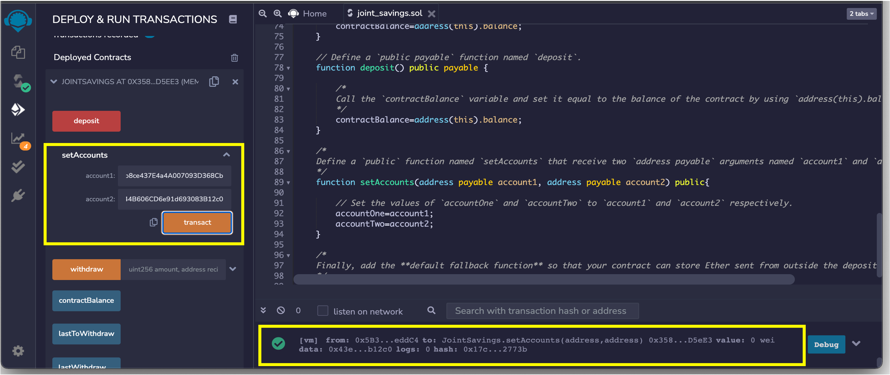
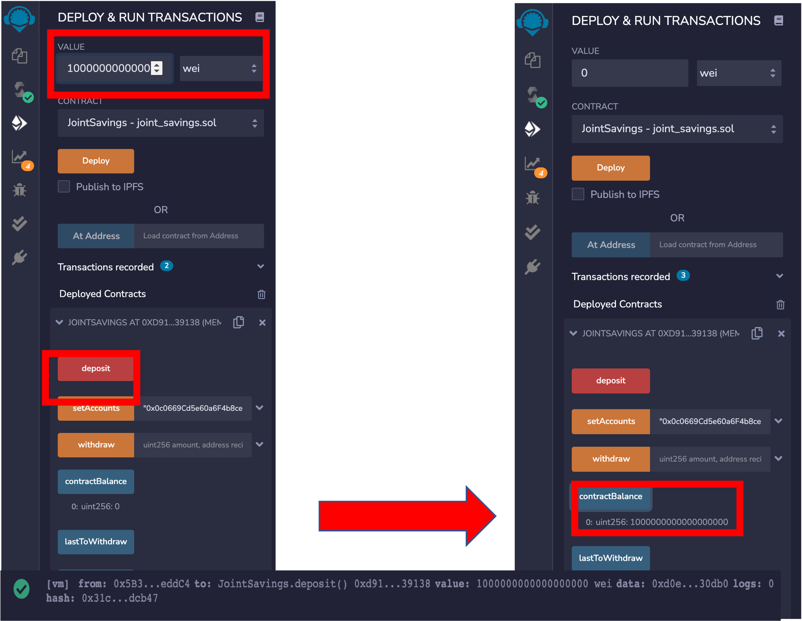
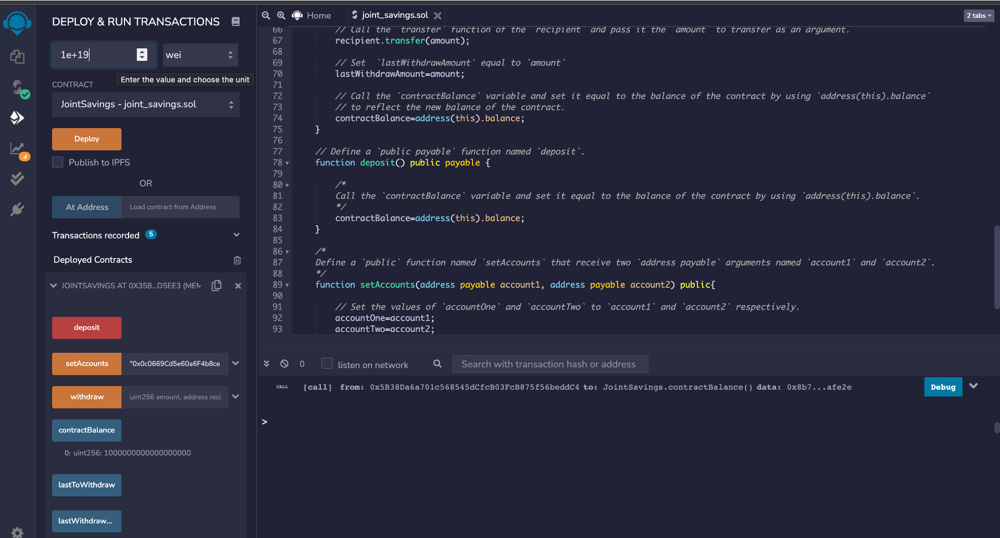
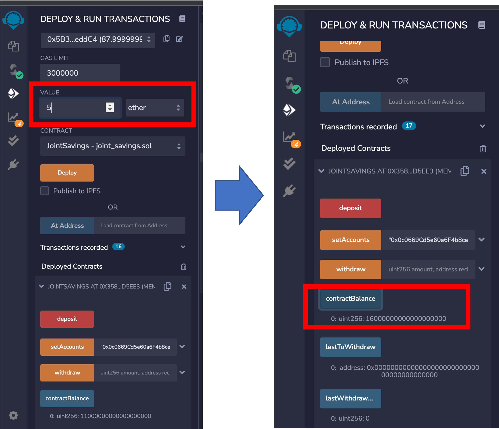
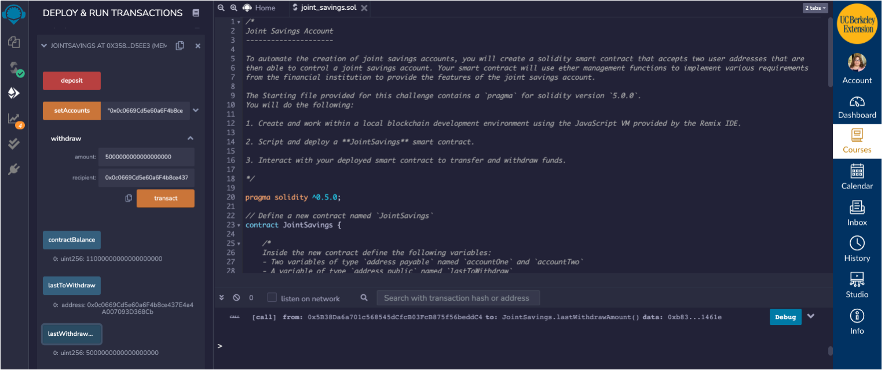
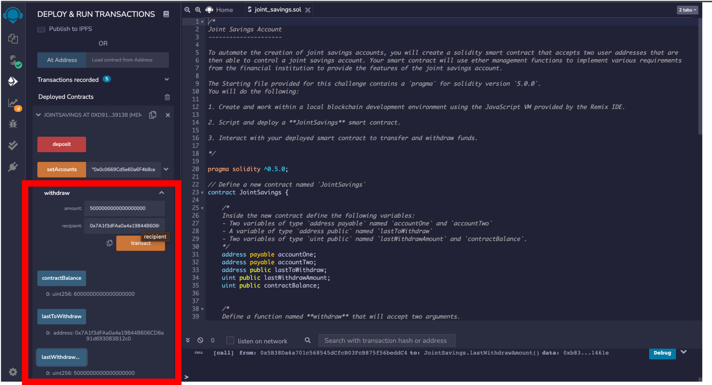

# Solidity Joint Saving Account
This project constructs a smart contract to automate an institutions’ financial process of hosting joint savings accounts. Specifically, for a fintech startup company which is disrupting the finance industry with its own cross-border, Ethereum-compatible blockchain that connects financial institutions. 

To automate the creation of joint savings accounts, we created a Solidity smart contract that accepts two user addresses. These addresses will be able to control a joint savings account. The smart contract uses ether management functions to implement a financial institution’s requirements for providing the features of the joint savings account. In this case, the ability to deposit and withdraw funds from the account.

What we created: 
    
   > * The completed Solidity JointSavings smart contract.

   > * A folder named Execution_Results that contains images to show the deposit and withdrawal transactions, tested in the JavaScript VM.
   
## Technologies
The project uses **Remix Ethereum IDE** to write and tedt the smart contract.


## Instalation Guide

To run the ```joint_savings.sol``` solidity smart contract file, you should save it to your local machine, and uploaded from Remix Ethereum IDE in the following link:

https://remix.ethereum.org/#optimize=false&runs=200&evmVersion=null&version=soljson-v0.8.7+commit.e28d00a7.js


## Usage

In order to operate the contract, you should first compile it, and then deploy it. Once you did that, same samples operations you can do with it are as follows:

1. **Set up accounts using the ```setAccounts``` function.** In the screenshot below we set up two dummy account1 and account2 as 

>Dummy account1 address: 0x0c0669Cd5e60a6F4b8ce437E4a4A007093D368Cb

>Dummy account2 address: 0x7A1f3dFAa0a4a19844B606CD6e91d693083B12c0

and run the function using the “transact button”. The output of the terminal confirming the execution can be seen in the long yellow rectangle below.





2. **Deposit currency using the ```Deposit``` function.** Here we show three different transactions.

    2.1 **Send 1 ether as wei.** One ether is equivalent to 1,000,000,000,000,000,000 (10^18) wei. So we select the wei token and deposit in the account. In the screenshot below you will be able to follow the flow of the transactions. It includes 3 screenshots in one image: First on the left, the amount and the highlight of the Deposit buttom that when clicked execute the transaction. Second at the bottom, the log record after the Deposit transaction indicating the execution of the function. Third to the right, the new balance in the joint account after pressing of the ContractBalance button.
    

    
   
    2.2 **Send 10 ether as wei.** Similarly than transaction 2.1, here we deposit 10 times 1,000,000,000,000,000,000 (10^19 wei). In the screenshot below you can see the contract balance of 11,000,000,000,000,000,000 wei after the execution.
    


    2.3. Send 5 ether. In this last deposit we choose another token, the ether. You can see the deefinition of amount, and the new contract balance after the deposit in the screenshot below.
    
    


3. **Withdrawal money from the contract to any of its two accounts using the _withdraw_ functionality.**

    3.1 Withdrawing 5 ether into accountOne. Below you can see the aftermath of the withdrawal, by looking at the contractBalance that got reduced from 16 to 11 ether (in wei counts), the lastWidraw indicator that shows account1, and the last widrawal amount that shows 5 ether (in wei counts).
    
 
    
    

    
    
    3.2 Withdrawing 10 ether into accountTwo. Similarly here, the aftermath can be seen in the contractBalance, last withdraw and lastWidrawAmount features highlighted in the red rectangle.
    
 


## Contributors
This project was coded by Paola Carvajal Almeida, QuantitativePaola@gmail.com.

Contact email: QuantitativePaola@gmail.com
LinkedIn profile: https://www.linkedin.com/in/paolacarvajal/
GitHub: https://github.com/paocarvajal1912


## License
This project uses a MIT license. This license allows you to use the licensed material at your discretion, as long as the original copyright and license are included in your work files. This license does not contain a patent grant,  and liberate the authors of any liability from the use of this code.


   
 
    
    

